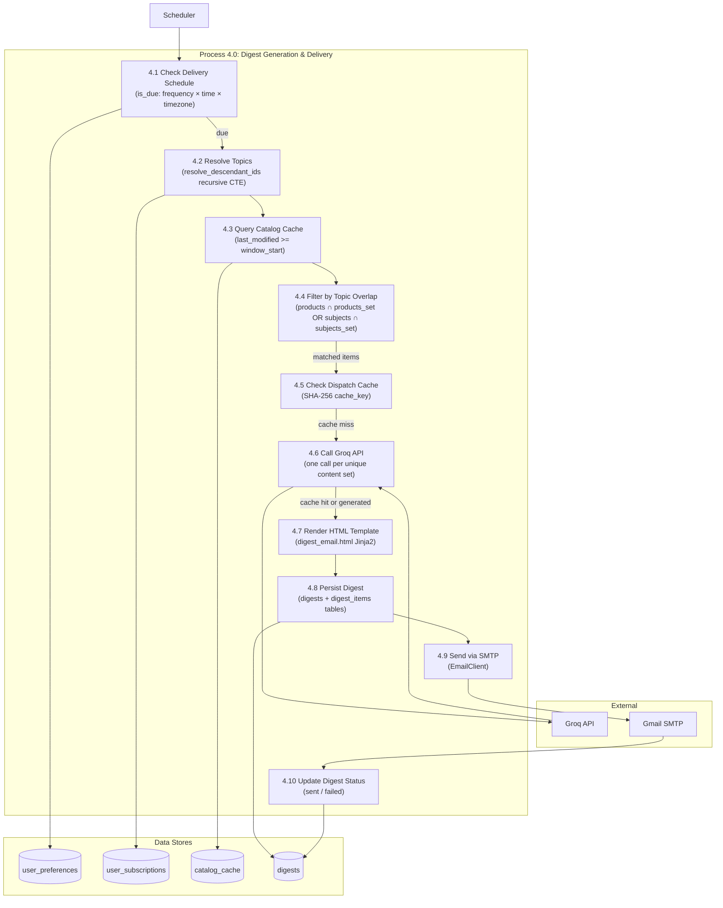
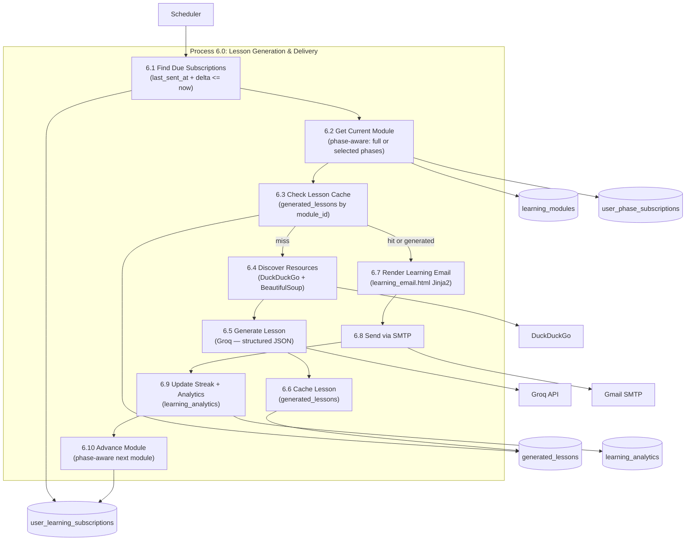
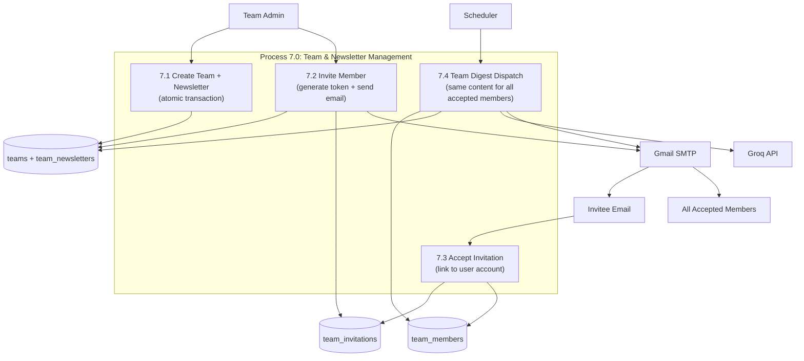

# Data Flow Diagram (DFD)
## MS Learn Digest

---

## Level 0 DFD — Context Diagram

```
                     ┌───────────────────────────────────────────┐
                     │                                           │
    ┌──────────┐     │         MS Learn Digest Platform          │     ┌─────────────────┐
    │   User   │────▶│  (topic subscriptions, learning tracks,  │────▶│    User Email   │
    │          │◀────│   digest preferences, team membership)    │     │   (newsletter)  │
    └──────────┘     │                                           │     └─────────────────┘
                     │                                           │
    ┌──────────┐     │                                           │     ┌─────────────────┐
    │  Admin   │────▶│                                           │────▶│  Member Emails  │
    │          │◀────│                                           │     │  (invitations)  │
    └──────────┘     │                                           │     └─────────────────┘
                     │                                           │
                     └─────────────┬─────────────────────────────┘
                                   │
          ┌────────────────────────┼─────────────────────────┐
          │                        │                         │
          ▼                        ▼                         ▼
  ┌──────────────┐      ┌──────────────────┐      ┌──────────────────┐
  │ MS Learn     │      │   Groq API       │      │  Google OAuth    │
  │ Catalog API  │      │ (Llama 3.3 70B)  │      │  (user auth)     │
  └──────────────┘      └──────────────────┘      └──────────────────┘
```

---

## Level 1 DFD — Major Processes

```mermaid
graph TB
    subgraph "External Entities"
        U[User]
        A[Admin]
        MS[MS Learn Catalog API]
        GR[Groq API]
        GO[Google OAuth]
        SMTP[Gmail SMTP]
        DDG[DuckDuckGo]
    end

    subgraph "Processes"
        P1["1.0\nAuthentication"]
        P2["2.0\nTopic & Preference\nManagement"]
        P3["3.0\nCatalog Sync"]
        P4["4.0\nDigest Generation\n& Delivery"]
        P5["5.0\nLearning Track\nManagement"]
        P6["6.0\nLesson Generation\n& Delivery"]
        P7["7.0\nTeam & Newsletter\nManagement"]
    end

    subgraph "Data Stores"
        D1[(users)]
        D2[(user_preferences)]
        D3[(topics / user_subscriptions)]
        D4[(catalog_cache)]
        D5[(digests / digest_items)]
        D6[(learning_topics / modules)]
        D7[(user_learning_subscriptions)]
        D8[(generated_lessons)]
        D9[(teams / members / newsletters)]
    end

    U -->|credentials / OAuth code| P1
    GO -->|user profile| P1
    P1 -->|JWT| U
    P1 -->|upsert user| D1

    U -->|topic selections, schedule| P2
    P2 -->|read topics| D3
    P2 -->|write subscriptions, preferences| D3
    P2 -->|write preferences| D2

    A -->|trigger sync| P3
    P3 -->|fetch catalog| MS
    MS -->|modules + learningPaths JSON| P3
    P3 -->|UPSERT| D4

    P4 -->|read subscriptions| D3
    P4 -->|query catalog_cache| D4
    P4 -->|generate AI content| GR
    GR -->|executive summary + item summaries| P4
    P4 -->|persist digest| D5
    P4 -->|send email| SMTP
    SMTP -->|delivered| U

    U -->|enroll / select phases| P5
    P5 -->|read topics| D6
    P5 -->|write subscription + phases| D7

    P6 -->|read due subscriptions| D7
    P6 -->|check lesson cache| D8
    P6 -->|resource search| DDG
    DDG -->|URLs| P6
    P6 -->|generate lesson| GR
    P6 -->|cache lesson| D8
    P6 -->|send lesson email| SMTP
    SMTP -->|delivered| U

    U -->|create team, invite| P7
    P7 -->|persist team + newsletter| D9
    P7 -->|send invitation| SMTP
    SMTP -->|invite email| U
```



---

## Level 2 DFD — Digest Generation Process (Process 4.0)



---

## Level 2 DFD — Learning Lesson Delivery Process (Process 6.0)



---

## Level 2 DFD — Team Newsletter Flow (Process 7.0)


