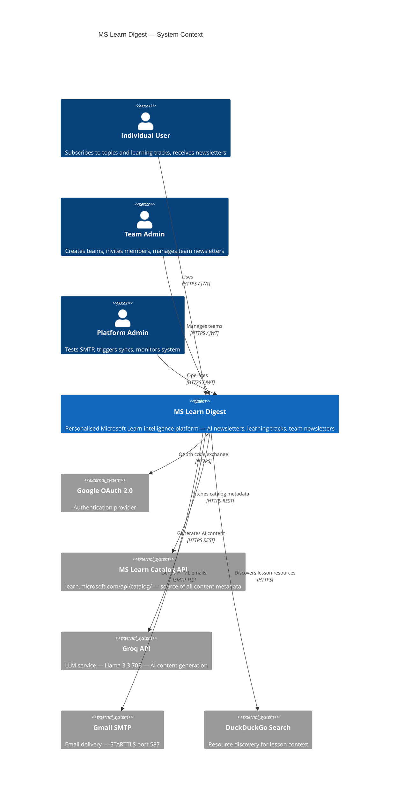
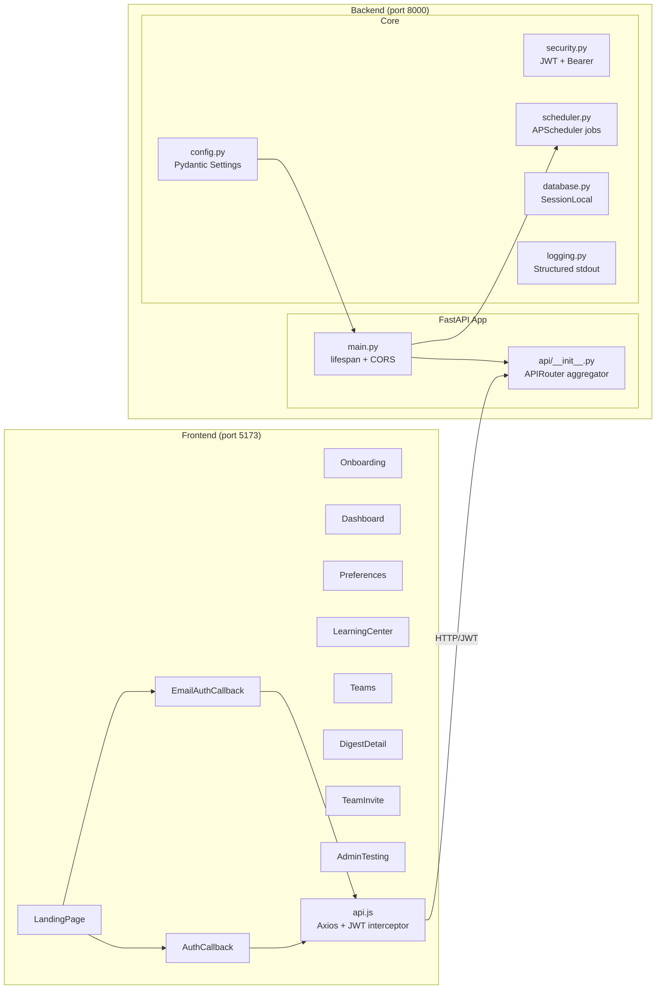
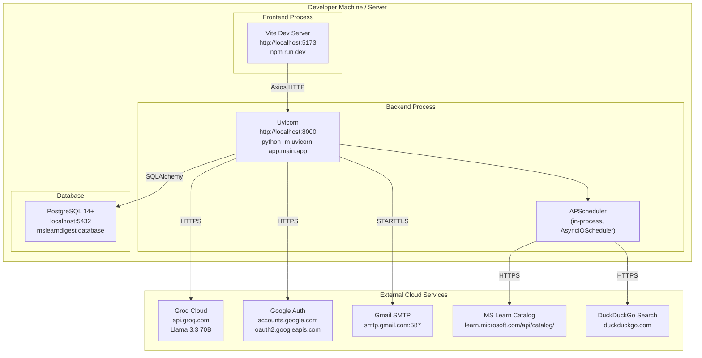
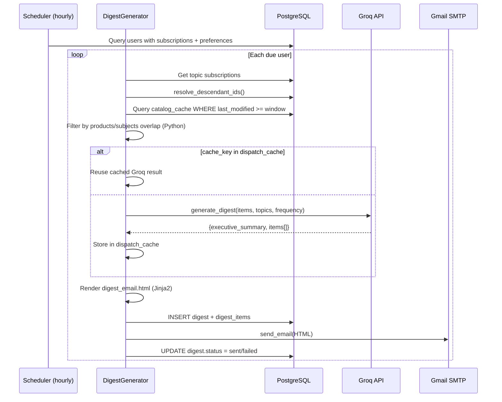
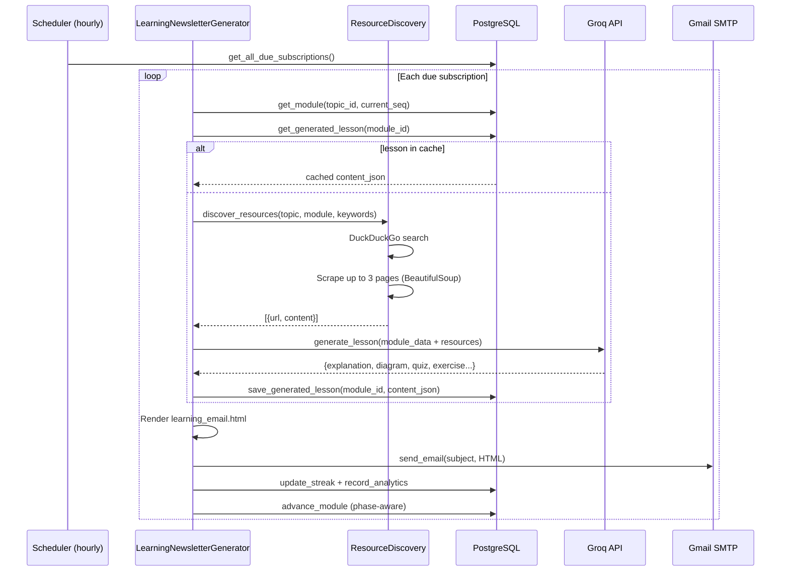

# Architecture Documentation
## MS Learn Digest

---

## 1. Context Diagram (Level 0)



---

## 2. Logical Architecture Diagram

```mermaid
graph TB
    subgraph "Presentation Layer"
        FE["React 19 SPA (Vite 8)\nTailwind CSS + Lucide React"]
    end

    subgraph "API Layer (FastAPI)"
        AUTH["/api/auth\nGoogle OAuth + Magic-Link"]
        USERS["/api/users\nProfile + Preferences"]
        TOPICS["/api/topics\nHierarchical Taxonomy"]
        DIGESTS["/api/digests\nDigest History"]
        LEARNING["/api/learning\nTracks + Phases + Progress"]
        TEAMS["/api/teams\nTeam + Newsletter Management"]
        ADMIN["/api/admin\nTesting + Diagnostics"]
    end

    subgraph "Service Layer"
        AS["AuthService\nEmailAuthService"]
        DS["DigestGenerator\n(Jinja2 rendering)"]
        LS["LearningNewsletterGenerator\nLessonGeneratorService"]
        CS["CatalogSyncService\nCatalogClient"]
        ES["EmailClient\n(smtplib)"]
        GS["GroqClient\n(digest + lesson generation)"]
        RD["ResourceDiscovery\n(DuckDuckGo + BeautifulSoup)"]
    end

    subgraph "Repository Layer"
        UR[UserRepository]
        TR[TopicRepository]
        DR[DigestRepository]
        LR[LearningRepository]
        TMR[TeamRepository]
    end

    subgraph "Scheduler (APScheduler)"
        SYNC["catalog_sync_job\n(daily 02:00 UTC)"]
        DISP["digest_dispatch_job\n(hourly)"]
        LEARN["learning_dispatch_job\n(hourly)"]
    end

    subgraph "Data Layer"
        PG[(PostgreSQL 14+\n20 tables)]
    end

    subgraph "External Services"
        GOOGLE[Google OAuth API]
        CATALOG[MS Learn Catalog API]
        GROQ_API[Groq API\nLlama 3.3 70B]
        SMTP_EXT[Gmail SMTP]
        DDG[DuckDuckGo Search]
    end

    FE -->|JWT Bearer| API Layer
    API Layer --> Service Layer
    Service Layer --> Repository Layer
    Repository Layer --> PG
    Scheduler --> Service Layer
    AS --> GOOGLE
    CS --> CATALOG
    GS --> GROQ_API
    ES --> SMTP_EXT
    RD --> DDG
```

---

## 3. Application Architecture Diagram



---

## 4. Deployment Architecture Diagram



---

## 5. Architecture Layers

| Layer | Technology | Responsibility |
|---|---|---|
| **Presentation** | React 19 + Vite + Tailwind | UI rendering, routing, state management (AuthContext) |
| **API Gateway** | FastAPI routers | Request validation, authentication, response serialization |
| **Service** | Python service classes | Business logic, orchestration, external API calls |
| **Repository** | SQLAlchemy repository pattern | Database access, query optimization |
| **Data** | PostgreSQL + Alembic | Persistence, schema evolution |
| **Scheduler** | APScheduler AsyncIOScheduler | Background jobs (sync, digest dispatch, learning dispatch) |
| **Email** | smtplib + Jinja2 templates | Email rendering and delivery |
| **AI** | Groq API + DuckDuckGo + BeautifulSoup | Content generation and resource discovery |
| **External Integration** | MS Learn Catalog API | Source of truth for learning content metadata |

---

## 6. Data Flow: Digest Generation



---

## 7. Data Flow: Learning Lesson Delivery


