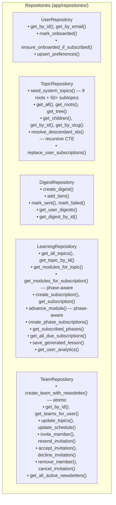
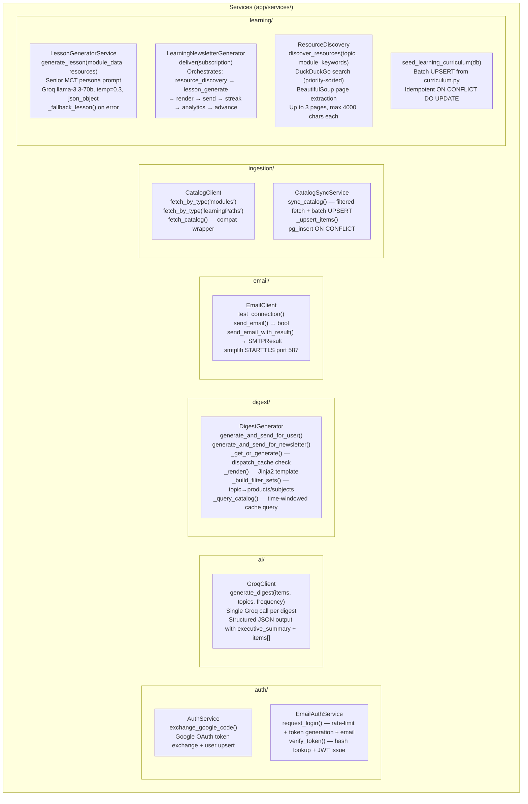
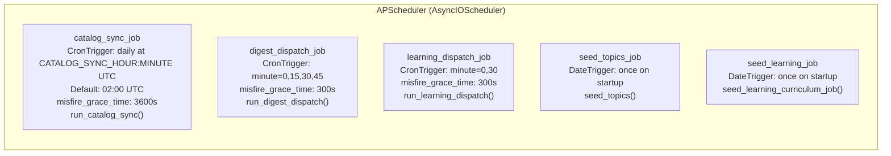
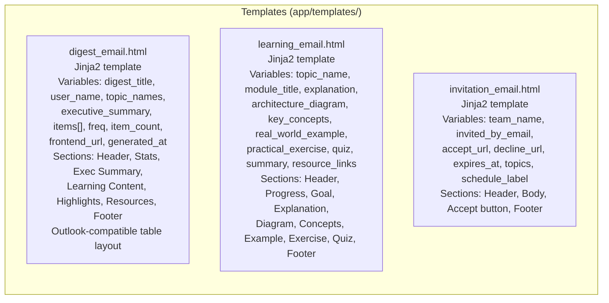

# Component Diagram
## MS Learn Digest

---

## Frontend Components

```mermaid
graph TB
    subgraph "Pages"
        LP[LandingPage\nGoogle + Email login buttons]
        AC[AuthCallback\nHandles Google OAuth code]
        EAC[EmailAuthCallback\nHandles magic-link token]
        OB[Onboarding\n2-step wizard]
        DASH[Dashboard\nDigest history list]
        PREF[Preferences\nTopics + schedule settings]
        LC[LearningCenter\nBrowse + active + completed tracks]
        TEAMS[Teams\nCreate / manage teams + newsletters]
        DD[DigestDetail\nFull digest HTML viewer]
        TI[TeamInvite\nPublic invite accept/decline]
        AT[AdminTesting\nSMTP test, sync, digest test]
    end

    subgraph "Components"
        LAY[Layout\nSidebar navigation + Outlet]
        TCG[TopicCardGrid\nCard-based topic selector\n• Search bar\n• Category filter chips\n• Expandable subtopics\n• Recommended section]
        TT[TopicTree\nTree view (unused in production,\navailable as fallback)]
        PS[PhaseSelector\nPhase enrollment modal\n• Full Track mode\n• Custom Phases mode\n• Frequency picker\n• Summary preview]
    end

    subgraph "Context"
        AUTH[AuthContext\nuseAuth hook\nJWT state management\nrefreshUser()]
    end

    subgraph "Services"
        API[api.js\nAxios instance\n• baseURL from VITE_API_URL\n• JWT interceptor\n• 401 auto-logout]
    end

    OB --> TCG
    PREF --> TCG
    LC --> PS
    DASH --> LAY
    PREF --> LAY
    LC --> LAY
    TEAMS --> LAY
    DD --> LAY
    AT --> LAY
    OB --> AUTH
    DASH --> AUTH
    API --> AUTH
    TCG --> API
    PS --> API
    LC --> API
    TEAMS --> API
```

---

## Backend Modules

```mermaid
graph TB
    subgraph "API Layer (app/api/)"
        R_AUTH[auth.py\nGoogle OAuth + Magic-Link\nEndpoints: /google, /email/request, /email/verify, /providers]
        R_USERS[users.py\nProfile + Preferences\nEndpoints: /me, /me/preferences]
        R_TOPICS[topics.py\nTopic tree + subscriptions\nEndpoints: /, /tree, /roots, /my, /subscribe, /onboard]
        R_DIGESTS[digests.py\nDigest history\nEndpoints: /, /{id}]
        R_LEARNING[learning.py\nTracks + phases + progress\nEndpoints: /topics, /subscribe, /my, /progress, /phases]
        R_TEAMS[teams.py\nTeam + newsletter management\nAll team + invite endpoints]
        R_NL[newsletters.py\nRead-only newsletter list\nEndpoints: /]
        R_ADMIN[admin.py\nAdmin testing + diagnostics\n14 endpoints]
    end

    subgraph "Core (app/core/)"
        CFG[config.py\nSettings — Pydantic Settings v2\n23 environment variables]
        SEC[security.py\ncreate_access_token()\ndecode_token()\nget_current_user_id() dependency]
        SCH[scheduler.py\nAPScheduler setup\n5 jobs: sync, digest, learning, seed_topics, seed_curriculum]
        DB[database.py\nSessionLocal\nget_db() dependency]
        LOG[logging.py\nsetup_logging()\nStructured stdout format]
    end

    subgraph "Models (app/models/)"
        M_USER[user.py → User]
        M_PREF[user_preference.py → UserPreference]
        M_AUTH[auth.py → EmailLoginToken]
        M_TOPIC[topic.py → Topic, UserSubscription]
        M_CATALOG[catalog_cache.py → CatalogCache]
        M_DIGEST[digest.py → Digest, DigestItem]
        M_TEAM[team.py → Team, TeamMember, TeamInvitation, TeamNewsletter, NewsletterTopic, SyncMetadata]
        M_LEARN[learning.py → LearningTopic, LearningModule, UserLearningSubscription, UserPhaseSubscription, GeneratedLesson, LearningAnalytics, LearningWeeklyReview]
    end
```

---

## Repositories



---

## Services



---

## Scheduler Jobs



---

## Email Templates


