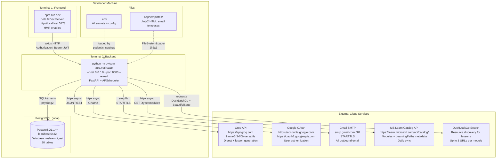
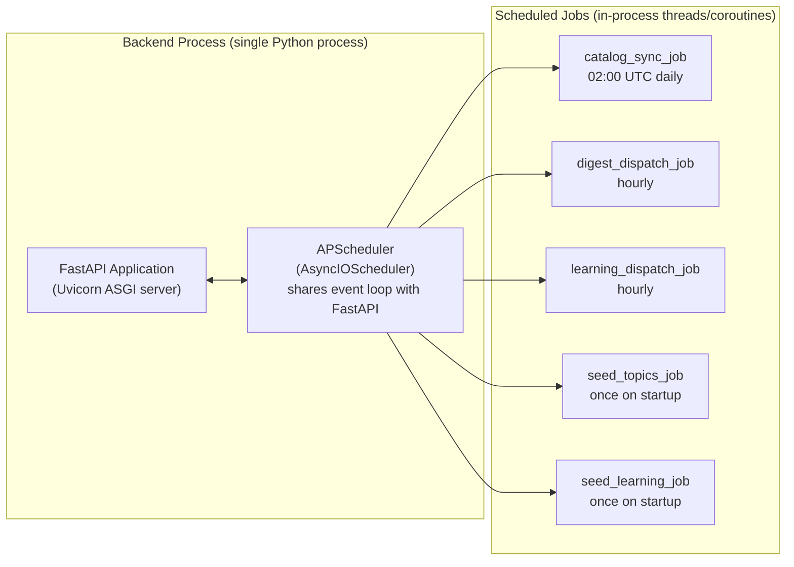
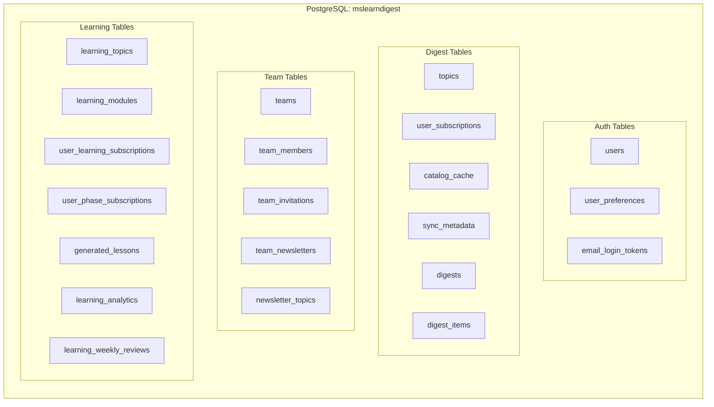

# Deployment Diagram
## MS Learn Digest

---

## Local Development Deployment



---

## Process Map



---

## Data Persistence Map



---

## Network Ports and Protocols

| Service | Port | Protocol | Direction |
|---|---|---|---|
| Vite Dev Server | 5173 | HTTP | Browser → Vite |
| FastAPI Backend | 8000 | HTTP | Browser/Vite → FastAPI |
| PostgreSQL | 5432 | TCP | FastAPI → PostgreSQL |
| Gmail SMTP | 587 | SMTP+STARTTLS | FastAPI → Gmail |
| Groq API | 443 | HTTPS | FastAPI → Groq |
| Google OAuth | 443 | HTTPS | FastAPI ↔ Google |
| MS Learn Catalog | 443 | HTTPS | FastAPI → MS Learn |
| DuckDuckGo | 443 | HTTPS | FastAPI → DuckDuckGo |

---

## Production Deployment Notes

No Docker configuration is currently included. For production deployment:

1. **Database:** Use a managed PostgreSQL service (AWS RDS, Azure Database for PostgreSQL, Supabase)
2. **Backend:** Deploy FastAPI app behind a reverse proxy (Nginx, Caddy) on a VM or PaaS (Railway, Render, Fly.io)
3. **Frontend:** Build with `npm run build` and serve static files via CDN or the same reverse proxy
4. **Environment:** All secrets in platform environment variables (not `.env` file)
5. **HTTPS:** Enforce at the reverse proxy / load balancer level
6. **Process management:** Use `systemd`, `supervisor`, or platform-native process management to keep Uvicorn running

**Key environment changes for production:**
```env
APP_ENV=production
ADMIN_ENABLED=false
FRONTEND_URL=https://your-domain.com
GOOGLE_REDIRECT_URI=https://your-backend-domain.com/auth/google/callback
JWT_SECRET_KEY=<64+ char random string>
```
