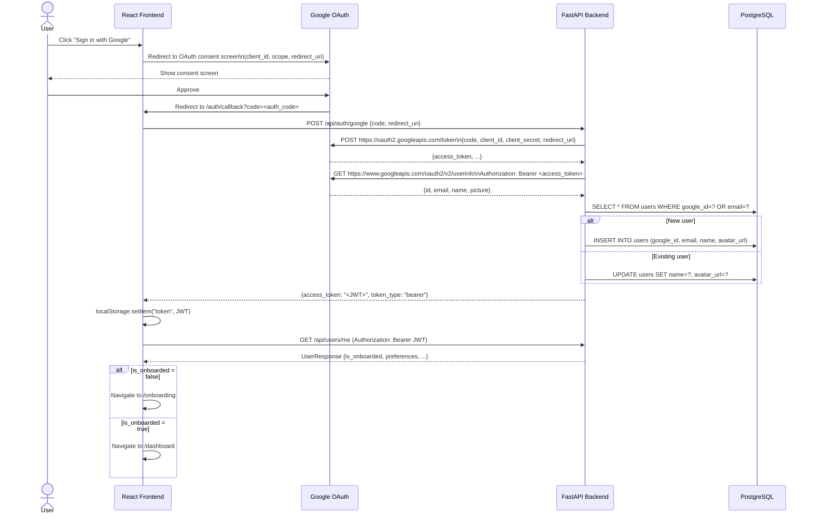
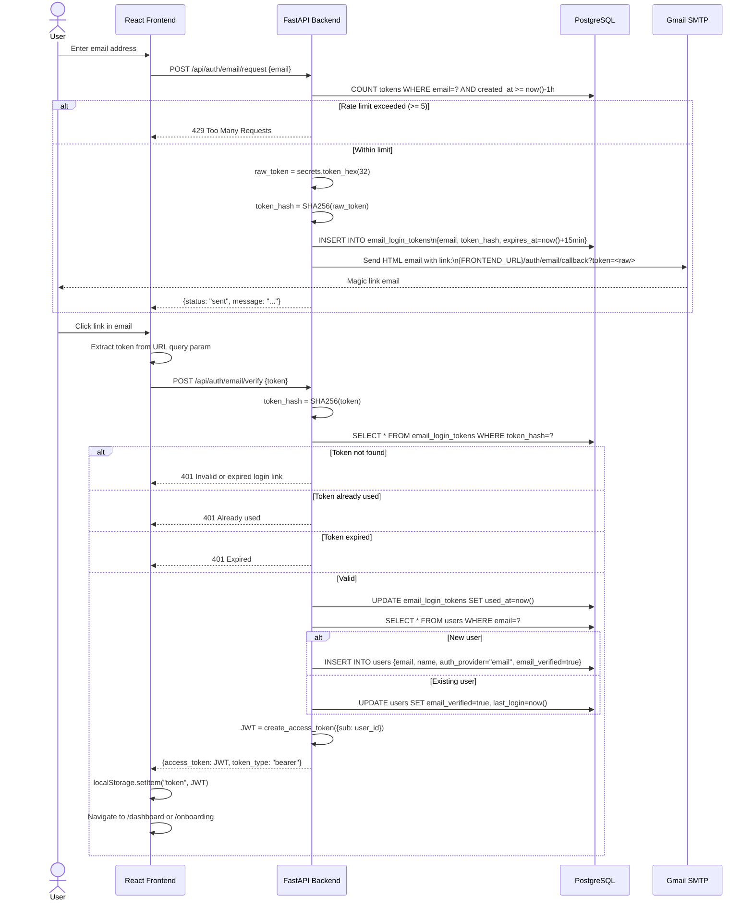
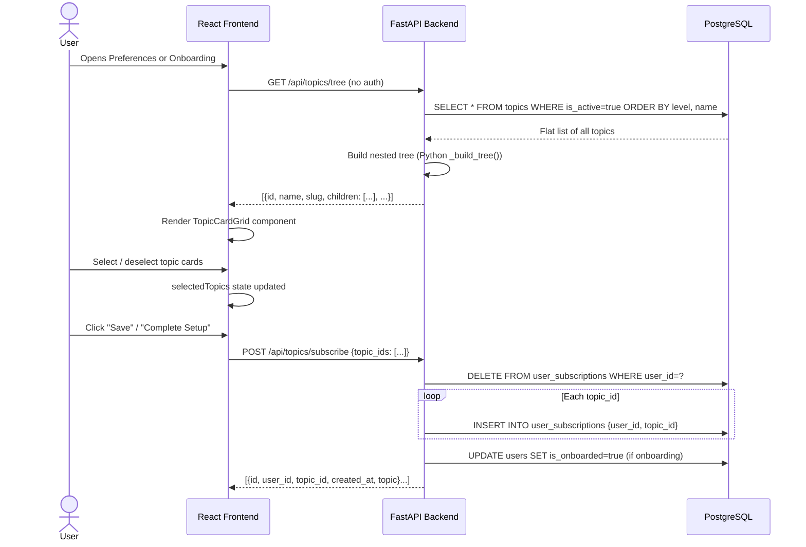
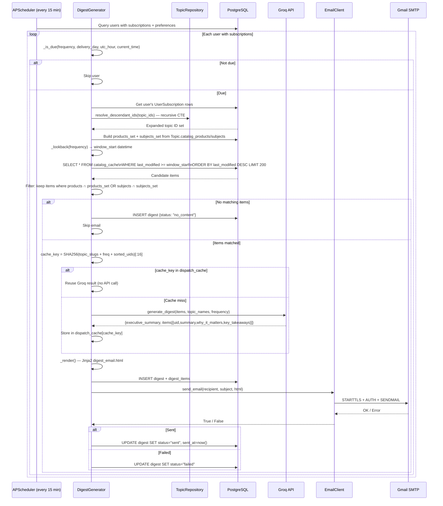
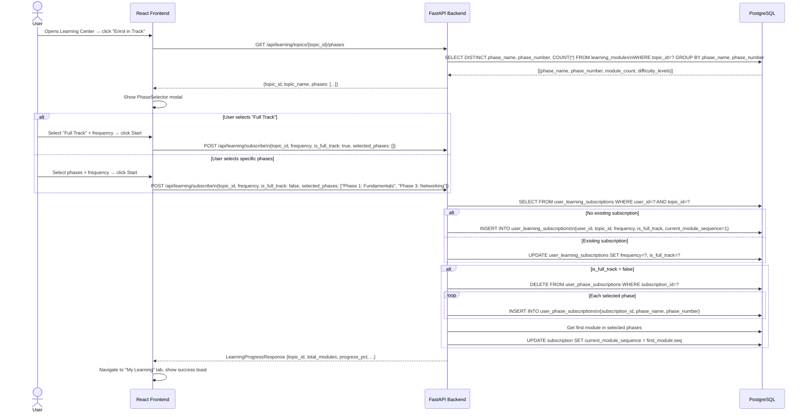
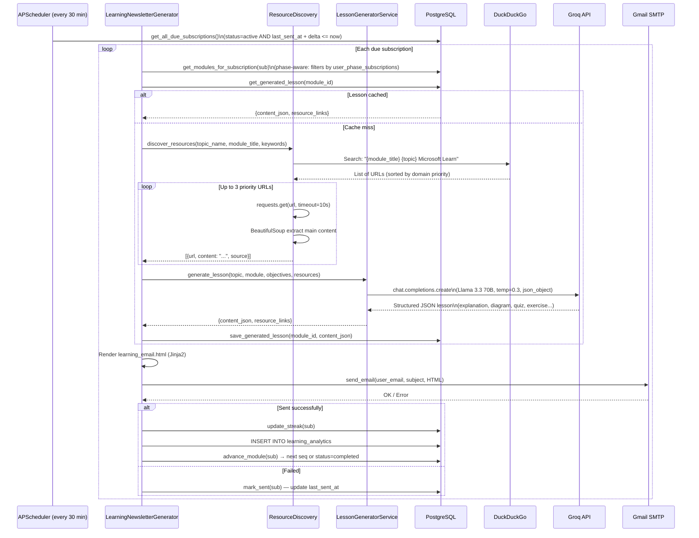
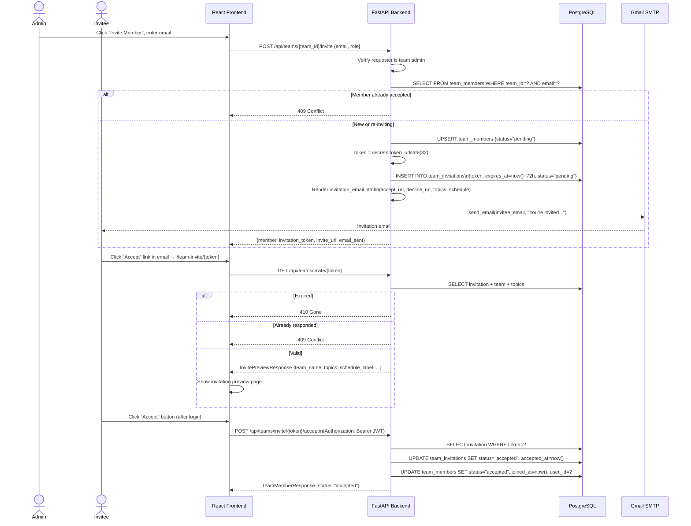

# Sequence Diagrams
## MS Learn Digest

---

## 1. Google Login Flow

---

## 2. Email Magic-Link Login Flow

---

## 3. Topic Subscription Flow

---

## 4. Digest Generation Flow

---

## 5. Learning Track Enrollment Flow

---

## 6. Lesson Generation Flow

---

## 7. Newsletter Delivery Flow (Individual Digest)

See Diagram 4 above. The individual and team newsletter flows share the same `DigestGenerator` — the team variant calls `generate_and_send_for_newsletter(newsletter)` instead of `generate_and_send_for_user(user)`, using the newsletter's topic list and sending to all `status=accepted` members.

---

## 8. Team Newsletter Invitation Flow

